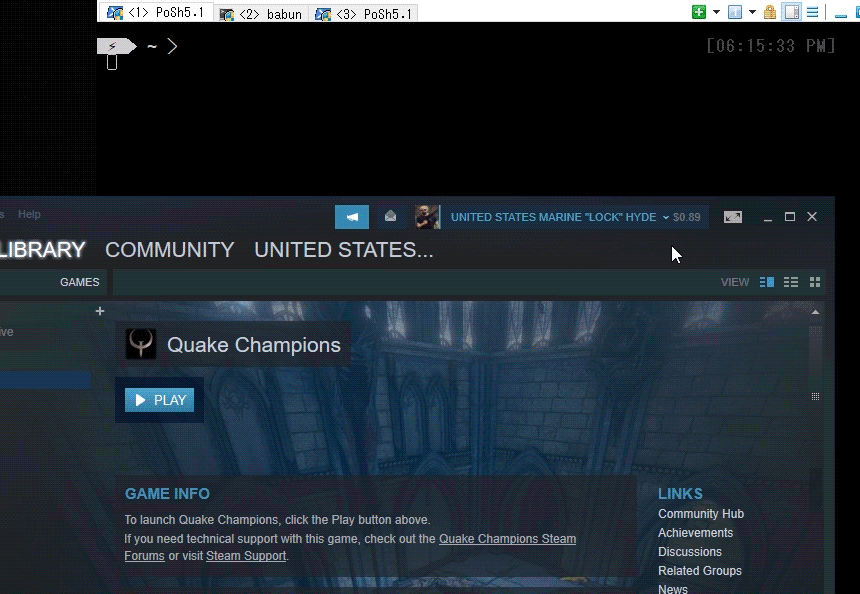

# PoSh-Steam
Powershell module for Valve's Steam platform. 

Currently exports the single command `Switch-SteamUser`, additional commands may be added in the future.

## Switch-SteamUser
Switch between previously logged in Steam accounts without password reentry or additional Steam Guard codes—basically 'Remember Me' on steroids.  First time logins will fall back to password entry, and after successful login (with 'Remember Me' ticked) additional logins with `Switch-SteamUser` should work as intended.
#### Demo: 

